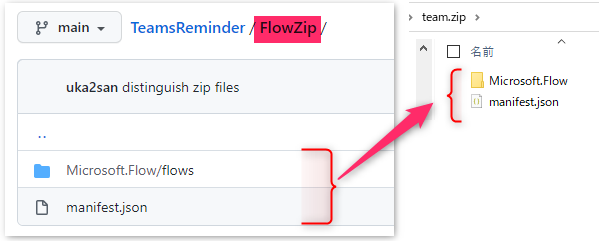
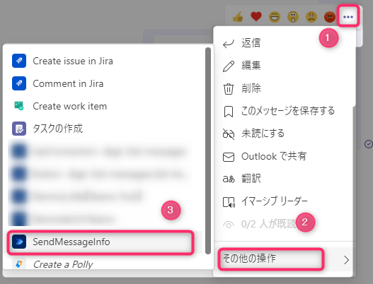
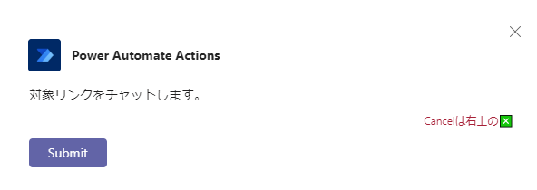
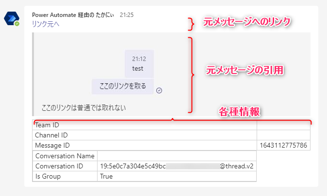

# PowerAutomateTools
tools created by Power Automate

# how to import
1. Download "ZipFiles" and zip them 
1. インポート at [Power Automate](https://japan.flow.microsoft.com/)

# how to use
## SendMessageInfo
1. リンクコピーが欲しいメッセージから、起動 
1. Submit で開始 
1. 以下での実行結果例 

